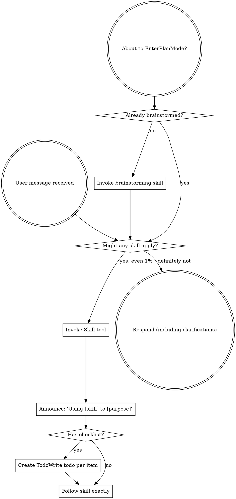

<SUBAGENT-STOP>
If you were dispatched as a subagent to execute a specific task, skip this skill.
</SUBAGENT-STOP>

<EXTREMELY-IMPORTANT>
If you think there is even a 1% chance a skill might apply to what you are doing, you ABSOLUTELY MUST invoke the skill.

IF A SKILL APPLIES TO YOUR TASK, YOU DO NOT HAVE A CHOICE. YOU MUST USE IT.

This is not negotiable. This is not optional. You cannot rationalize your way out of this.
</EXTREMELY-IMPORTANT>

## Instruction Priority

Superpowers skills override default system prompt behavior, but **user instructions always take precedence**:

1. **User's explicit instructions** (CLAUDE.md, GEMINI.md, AGENTS.md, direct requests) — highest priority
2. **Superpowers skills** — override default system behavior where they conflict
3. **Default system prompt** — lowest priority

If CLAUDE.md, GEMINI.md, or AGENTS.md says "don't use TDD" and a skill says "always use TDD," follow the user's instructions. The user is in control.

## Explicit Opt-Out

If the user asks to disable, pause, suspend, silence, or stop superpowers or mandatory skill routing, invoke `disable-superpowers` immediately.

While `disable-superpowers` is active, do not auto-route into other superpowers skills. Only resume if the user explicitly asks to re-enable superpowers or explicitly names a specific skill to use.

## Gated Superpowers Skills

Most superpowers skills phrase their descriptions as "Relevant only after using-superpowers is active, unless the user explicitly requests this skill by name; use when ...".

Treat that description text as the routing gate:

- If the user explicitly names the skill, invoke it immediately even if `using-superpowers` is not active.
- If the user did not explicitly name the skill, you may proactively route into that skill only after `using-superpowers` is already active.
- Without `using-superpowers` or an explicit skill request, do not auto-invoke gated superpowers skills based only on their descriptions.

## Hidden Superpowers Skills

Some installs intentionally expose only `using-superpowers` through the platform's native skill discovery.

If another superpowers skill should apply but is not available in the platform's skill list, read `references/hidden-skills.md`, choose the matching skill, then read that skill's `SKILL.md` directly from the listed path and follow it.

The "never use Read on skill files" rule applies to installed skills. Hidden superpowers skills are the exception: if the platform cannot invoke them natively, read their files directly.

## How to Access Skills

**In Claude Code:** Use the `Skill` tool. When you invoke a skill, its content is loaded and presented to you—follow it directly. Never use the Read tool on skill files.

**In Copilot CLI:** Use the `skill` tool. Skills are auto-discovered from installed plugins. The `skill` tool works the same as Claude Code's `Skill` tool.

**In Gemini CLI:** Skills activate via the `activate_skill` tool. Gemini loads skill metadata at session start and activates the full content on demand.

**In other environments:** Check your platform's documentation for how skills are loaded.

## Platform Adaptation

Skills use Claude Code tool names. Non-CC platforms: see `references/copilot-tools.md` (Copilot CLI), `references/codex-tools.md` (Codex) for tool equivalents. Gemini CLI users get the tool mapping loaded automatically via GEMINI.md.

# Using Skills

## The Rule

**Invoke relevant or requested skills BEFORE any response or action.** Even a 1% chance a skill might apply means that you should invoke the skill to check. If an invoked skill turns out to be wrong for the situation, you don't need to use it.

## Red Flags

These thoughts mean STOP—you're rationalizing:

| Thought | Reality |
|---------|---------|
| "This is just a simple question" | Questions are tasks. Check for skills. |
| "I need more context first" | Skill check comes BEFORE clarifying questions. |
| "Let me explore the codebase first" | Skills tell you HOW to explore. Check first. |
| "I can check git/files quickly" | Files lack conversation context. Check for skills. |
| "Let me gather information first" | Skills tell you HOW to gather information. |
| "This doesn't need a formal skill" | If a skill exists, use it. |
| "I remember this skill" | Skills evolve. Read current version. |
| "This doesn't count as a task" | Action = task. Check for skills. |
| "The skill is overkill" | Simple things become complex. Use it. |
| "I'll just do this one thing first" | Check BEFORE doing anything. |
| "This feels productive" | Undisciplined action wastes time. Skills prevent this. |
| "I know what that means" | Knowing the concept ≠ using the skill. Invoke it. |

## Skill Priority

When multiple skills could apply, use this order:

1. **Process skills first** (brainstorming, debugging) - these determine HOW to approach the task
2. **Implementation skills second** (frontend-design, mcp-builder) - these guide execution

"Let's build X" → brainstorming first, then implementation skills.
"Fix this bug" → debugging first, then domain-specific skills.

## Fast Routing

Once `using-superpowers` is active, stop thinking in generic terms and route the task to a concrete skill name immediately.

| If the task looks like this | Invoke this skill |
|---------|---------|
| User asks to disable, pause, or stop superpowers skill routing | `disable-superpowers` |
| New feature, behavior change, ambiguous request, requirements exploration | `brainstorming` |
| Spec or approved design exists and work needs a multi-step implementation plan | `writing-plans` |
| Written implementation plan exists and you are executing it in a fresh/separate session | `executing-plans` |
| Written implementation plan exists and the work can be split across independent tasks in the current session | `subagent-driven-development` |
| Two or more independent tasks can run in parallel without blocking each other | `dispatching-parallel-agents` |
| Starting feature work and you need workspace isolation from current changes | `using-git-worktrees` |
| Any feature, bugfix, refactor, or behavior change before writing code | `test-driven-development` |
| Bug report, failing test, flaky behavior, regression, or unexpected output | `systematic-debugging` |
| Work is implemented and you need review before merge or handoff | `requesting-code-review` |
| You received review comments and need to validate or apply them safely | `receiving-code-review` |
| You are about to say work is complete, fixed, or passing | `verification-before-completion` |
| Implementation is done and you need to decide merge, PR, or cleanup flow | `finishing-a-development-branch` |
| You are creating or editing a skill, or checking whether a skill is written well | `writing-skills` |

If one row matches, invoke that skill now. Do not wait for the user to say the skill's exact name.

## Trigger Discipline

Translate user intent into skill triggers aggressively:

- "build", "add", "create", "change", "implement" usually means `brainstorming` first
- "disable superpowers", "pause skills", "stop using these workflows" usually means `disable-superpowers`
- "bug", "fix", "broken", "failing", "flaky", "unexpected" usually means `systematic-debugging` first
- "plan", "steps", "spec", "design doc" usually means `writing-plans`
- "done", "finished", "works now", "passing" usually means `verification-before-completion`
- "review", "merge", "PR", "ship" usually means `requesting-code-review` or `finishing-a-development-branch`

Do not require perfect wording. Match intent, then invoke the skill.

## Skill Types

**Rigid** (TDD, debugging): Follow exactly. Don't adapt away discipline.

**Flexible** (patterns): Adapt principles to context.

The skill itself tells you which.

## User Instructions

Instructions say WHAT, not HOW. "Add X" or "Fix Y" doesn't mean skip workflows.
